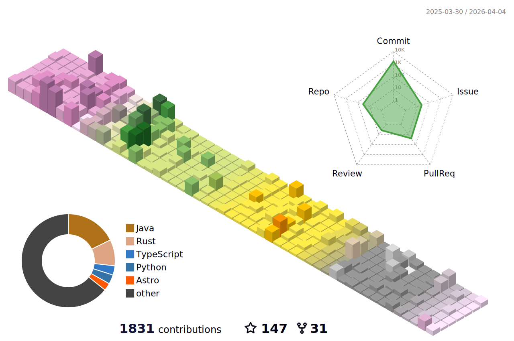

<h1 align="center">Hi 👋, I'm Maoyue</h1>

* * *  

  

* * *

- 🎢 I'm the owner of [MilkTeaMC](https://github.com/milkteamc). It's a cool Minecraft server.

- 🌱 I’m currently learning **Java, Python and Rust**

<h3 align="left">Connect with me:</h3>

* * *

<h3 align="left">Commits:</h3>

* * *

